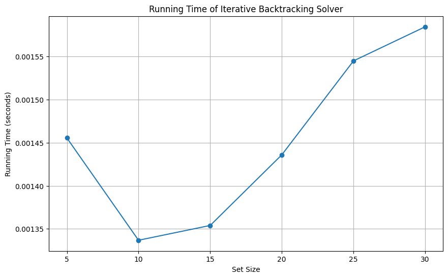
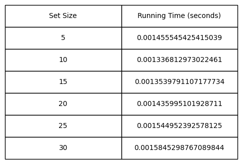

## Analysis of the Subset Sum Solver

### 1. Comparison with Dynamic Programming

The Subset Sum Problem can be approached using both Dynamic Programming (DP) and Backtracking algorithms. Each approach has its strengths and weaknesses depending on the specific requirements of the problem.

#### Dynamic Programming Approach

Dynamic Programming constructs a table to store the results of subproblems. It builds up the solution by combining the results of these subproblems. This approach is efficient in terms of time complexity, as it avoids redundant calculations by reusing previously computed results.

- **Time Complexity**: $$O(n \cdot k)$$, where \(n\) is the number of elements in the set, and \(k\) is the target sum.
- **Space Complexity**: $$O(k)$$, which is required to store the DP table.

The DP approach is particularly efficient when we need to determine if a subset with the given sum exists. However, it does not efficiently produce all possible subsets that meet the criteria.

#### Backtracking Approach

The Backtracking algorithm explores all possible subsets using a depth-first search method. It incrementally builds candidates to the solution and abandons a candidate ("backtracks") as soon as it determines that this candidate cannot possibly be a valid solution.

- **Time Complexity**: $$O(2^n)$$ in the worst case, as it examines all subsets of the set.
- **Space Complexity**: $$O(n)$$, due to the stack used in the algorithm.

The backtracking approach is powerful because it finds all subsets that sum to the target. However, it can be slow for large input sizes due to its exponential time complexity.

### 2. Performance Graphs

To visualize the performance of our backtracking solver, we used Python to create performance graphs and visualizations. The real-time running time was graphed as the size of the input set increases. This helps illustrate the exponential nature of the backtracking algorithm's running time.

We also created a table to display the set sizes and their corresponding running times.

### 3. Factors Affecting Running Time

Several factors can affect the real-time running time of the backtracking solver:

- **Variation of Inputs**: Sets with larger values may increase the number of possible subsets, thereby increasing the running time.
- **Size of Inputs**: Larger integers in the set can lead to more iterations and deeper recursive calls in the backtracking process.
- **Distance to Target**: If the target sum is much smaller relative to the sum of the entire set, the algorithm might find solutions more quickly. Conversely, if the target is close to the total sum of the set, the running time might increase.

In conclusion, while both Dynamic Programming and Backtracking have their merits, the choice between them depends on the specific requirements of the problem. For producing all valid subsets, backtracking is the preferred method, despite its potential for higher running time in larger inputs.
